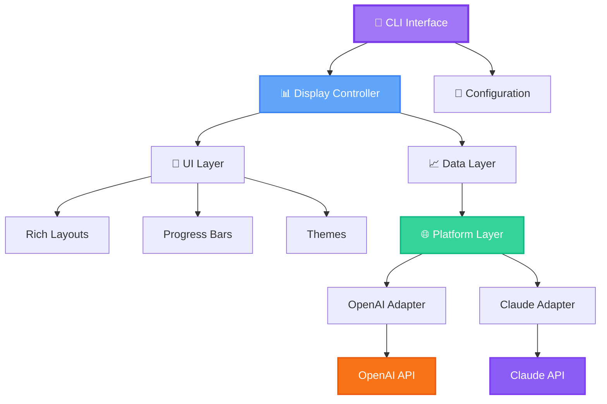

<div align="center">


# 🎯 GenAI Code Usage Monitor

### *The Ultimate Real-Time Terminal Dashboard for Your AI APIs*

<p align="center">
  <strong>Monitor OpenAI Codex & Claude Code APIs with Style and Precision</strong>
</p>

---

### Languages / 语言

**English** | [中文](./README.zh-CN.md)

---

<p>
  <a href="https://pypi.org/project/genai-code-usage-monitor/">
    
  </a>
  <a href="https://python.org">
    
  </a>
  <a href="https://opensource.org/licenses/MIT">
    
  </a>
</p>

<p>
  <a href="http://makeapullrequest.com">
    
  </a>
  <a href="https://github.com/yourusername/genai-code-usage-monitor">
    
  </a>
  <a href="https://www.w3.org/WAI/WCAG2AA-Conformance">
    
  </a>
</p>

<p>
  
  
  
</p>


*Experience real-time monitoring with beautiful terminal UI, intelligent alerts, and ML-powered predictions*

[🚀 Quick Start](#-quick-start) • [✨ Features](#-features) • [📖 Documentation](#-documentation) • [🤝 Contributing](#-contributing)

</div>

---

## 🌟 Why Choose GenAI Code Usage Monitor?

<table>
<tr>
<td width="50%">

### 🎨 **Beautiful & Accessible**
- WCAG 2.1 AA compliant color schemes
- Auto-detects terminal background
- Rich terminal UI with progress bars
- Three stunning themes: Light, Dark, Classic

</td>
<td width="50%">

### 🚀 **Dual Platform Support**
- Monitor OpenAI Codex/GPT APIs
- Track Claude Code usage
- Unified interface for both platforms
- Compare costs across platforms

</td>
</tr>
<tr>
<td width="50%">

### 💰 **Cost Optimization**
- Track cached tokens (90% discount!)
- Real-time burn rate analysis
- Budget alerts & recommendations
- ML-based usage predictions

</td>
<td width="50%">

### ⚡ **Smart & Fast**
- P90 percentile analytics
- 4-level alert system (INFO/WARNING/CRITICAL/DANGER)
- Configurable refresh rates
- Multi-threaded architecture

</td>
</tr>
</table>

---

## ✨ Features

### 🔥 Core Features

```ascii
┌─────────────────────────────────────────────────────────────────┐
│  🎯 Dual Platform Support    │  📊 Advanced Analytics          │
│  🎨 WCAG-Compliant Themes    │  💾 Cached Token Tracking       │
│  ⚠️  4-Level Alert System     │  🔮 ML-Based Predictions        │
│  📈 Multiple View Modes       │  🚀 Real-Time Monitoring        │
└─────────────────────────────────────────────────────────────────┘
```

<details>
<summary>🔍 Click to see all features in detail</summary>

#### 🌐 **Dual Platform Support**
- ✅ OpenAI Codex/GPT API monitoring
- ✅ Claude Code API monitoring
- ✅ Platform auto-detection
- ✅ Side-by-side comparison mode
- ✅ Platform-specific features (cache tracking for Claude)

#### 📊 **Advanced Analytics**
- ✅ Token usage tracking (input/output/cached)
- ✅ Cost calculation with model-specific pricing
- ✅ Burn rate analysis
- ✅ P90 percentile calculations
- ✅ Session limit predictions

#### 🎨 **Professional UI**
- ✅ Rich terminal layouts with color-coded progress bars
- ✅ Three WCAG-compliant themes (Light/Dark/Classic)
- ✅ Automatic terminal background detection
- ✅ Responsive design that adapts to terminal size
- ✅ Unicode charts and visualizations

#### ⚠️ **Intelligent Alerts**
- ✅ 4-tier alerting: INFO → WARNING → CRITICAL → DANGER
- ✅ Smart threshold detection
- ✅ Actionable recommendations
- ✅ Time-to-limit estimation

#### 💾 **Cache Optimization** (Claude)
- ✅ Cached token tracking with 90% discount
- ✅ Cache hit rate monitoring
- ✅ Real-time savings analytics
- ✅ Cache efficiency recommendations

#### 🔮 **ML Predictions**
- ✅ Usage trend forecasting
- ✅ Cost projections
- ✅ Confidence scores
- ✅ Intelligent limit detection

</details>

---

## 🚀 Quick Start

### ⚡ Installation (Choose One)

<table>
<tr>
<td width="33%">

#### 🎯 **uv (Recommended)**
```bash
# Install uv
curl -LsSf https://astral.sh/uv/install.sh | sh

# Install tool
uv tool install genai-code-usage-monitor

# Run
code-monitor
```
✅ Isolated environment
✅ No conflicts
✅ Easy updates

</td>
<td width="33%">

#### 📦 **pip**
```bash
# Install
pip install genai-code-usage-monitor

# Add to PATH
export PATH="$HOME/.local/bin:$PATH"

# Run
code-monitor
```
✅ Simple
✅ Familiar
✅ Works everywhere

</td>
<td width="33%">

#### 🍺 **Homebrew**
```bash
# Install
brew install code-monitor

# Run
code-monitor
```
✅ Native macOS
✅ Auto-updates
✅ Clean uninstall

</td>
</tr>
</table>

### 🎬 First Run

```bash
# Set your API key
export OPENAI_API_KEY="sk-..."
# or
export ANTHROPIC_API_KEY="sk-ant-..."

# Launch monitor
code-monitor

# 🎉 That's it! Monitor is running
```

---

## 📸 Screenshots & Demos

> 🎬 **Live Demo**: See the monitor in action below or [contribute screenshots](docs/SCREENSHOTS.md)!

<div align="center">

### 🌙 Dark Theme - Real-time Monitoring

```
┌─────────────────────── GenAI Code Usage Monitor ────────────────────────┐
│                                                                          │
│  Platform: OpenAI Codex          Theme: Dark          View: Realtime   │
│                                                                          │
│  📊 Current Session                                                      │
│  ├─ Input Tokens:     12,450  ████████████████████░░░░░  62%          │
│  ├─ Output Tokens:     8,320  ██████████████░░░░░░░░░░░  41%          │
│  ├─ Total Tokens:     20,770  ████████████████░░░░░░░░░  52%          │
│  └─ Cost:              $0.42  █████████████████░░░░░░░░  84%          │
│                                                                          │
│  ⚠️  WARNING: You've used 84% of your budget                             │
│                                                                          │
│  🔮 Predictions                                                          │
│  ├─ Estimated limit reach: ~2.5 hours                                  │
│  ├─ Recommended action: Reduce token usage                             │
│  └─ Burn rate: $0.17/hour                                              │
│                                                                          │
└──────────────────────────────────────────────────────────────────────────┘
```

*Beautiful WCAG-compliant dark theme with real-time progress tracking*

### ☀️ Light Theme - Daily Statistics

```
┌─────────────────────── Daily Usage Report ──────────────────────────┐
│                                                                      │
│  Date        Models    Input     Output    Total      Cost         │
│  ─────────── ───────── ───────── ───────── ────────── ────────────│
│  2025-10-28  GPT-4     45.2K     32.1K     77.3K      $1.55        │
│  2025-10-27  GPT-4     38.7K     28.4K     67.1K      $1.34        │
│  2025-10-26  GPT-3.5   52.3K     39.2K     91.5K      $0.18        │
│                                                                      │
│  📈 7-Day Average: $1.02/day    📊 Total: $7.14                     │
│                                                                      │
└──────────────────────────────────────────────────────────────────────┘
```

*Clean light theme perfect for bright environments*

### 🎨 Dual Platform - Split Screen

```
┌──────────── OpenAI Codex ────────────┬──────────── Claude Code ─────────────┐
│                                      │                                      │
│  📊 Usage: 52% ████████████░░░░░░░  │  📊 Usage: 38% ████████░░░░░░░░░░  │
│  💰 Cost:  $0.42                     │  💰 Cost:  $0.28                     │
│  📈 Tokens: 20.7K                    │  📈 Tokens: 15.2K                    │
│                                      │  💾 Cache Hit Rate: 45%              │
│                                      │  💰 Cache Savings: $0.12 (90% off)  │
│                                      │                                      │
└──────────────────────────────────────┴──────────────────────────────────────┘
```

*Monitor both platforms simultaneously with platform-specific metrics*

</div>

### 🎥 Want to See Real Screenshots?

<div align="center">

| Action | Description |
|:------:|:------------|
| 🚀 **[Try It Now](#-quick-start)** | Install and run the monitor yourself |
| 📸 **[Screenshot Guide](docs/SCREENSHOTS.md)** | Learn how to capture beautiful screenshots |
| 🤝 **[Contribute](CONTRIBUTING.md)** | Add your screenshots to the project |

**Help us showcase the project!** We welcome screenshot contributions. See the [Screenshot Guide](docs/SCREENSHOTS.md) for details.

</div>

---

## 💡 Usage Examples

### 🎯 **Single Platform**

```bash
# Monitor OpenAI (default)
code-monitor

# Monitor Claude
code-monitor --platform claude

# Auto-detect from environment
code-monitor --platform auto
```

### 🔄 **Dual Platform**

```bash
# Monitor both platforms side-by-side
code-monitor --platform both

# Export comparison report
code-monitor --platform both --export comparison.json
```

### 🎨 **Theme Selection**

```bash
# Auto-detect (recommended)
code-monitor --theme auto

# Specific themes
code-monitor --theme dark
code-monitor --theme light
code-monitor --theme classic
```

### ⚙️ **Advanced Configuration**

```bash
# Custom plan with token limit
code-monitor --plan custom --custom-limit-tokens 100000

# Fast refresh for active development
code-monitor --refresh-rate 5

# Debug mode with logging
code-monitor --debug --log-file monitor.log

# Different timezone
code-monitor --timezone America/New_York
```

---

## 📊 Monitoring Plans

<div align="center">

| Plan | Token Limit | Cost Limit | Best For | Command |
|:----:|:-----------:|:----------:|:--------:|:--------|
| 🆓 **Free** | 100,000 | $0 | Free tier users | `--plan free` |
| 💳 **Pay-As-You-Go** | Unlimited | $100 | Flexible usage | `--plan payg` |
| 🥉 **Tier 1** | 1,000,000 | $50 | Medium usage | `--plan tier1` |
| 🥇 **Tier 2** | 5,000,000 | $250 | Heavy usage | `--plan tier2` |
| 🎯 **Custom** | P90-based | $50 | Intelligent detection | `--plan custom` ⭐ |

</div>

> 💡 **Tip**: The Custom plan (default) automatically learns from your usage patterns using P90 analysis!

---

## 🏗️ Architecture

<div align="center">



</div>

### 📦 Project Structure

```
genai-code-usage-monitor/
├── 🎯 cli/                    # Command-line interface
├── 🧠 core/                   # Business logic
│   ├── models.py              # Data models
│   ├── plans.py               # Plan definitions
│   ├── pricing.py             # Cost calculator
│   ├── alerts.py              # Alert system
│   └── p90_calculator.py      # ML analytics
├── 🌐 platforms/              # Platform abstraction
│   ├── base.py                # Platform interface
│   ├── codex.py               # OpenAI adapter
│   └── claude.py              # Claude adapter
├── 🎨 ui/                     # UI components
│   ├── display.py             # Rich display
│   ├── themes.py              # WCAG themes
│   └── visualizations.py      # Charts & graphs
└── 🛠️ utils/                  # Utilities
    └── time_utils.py          # Time functions
```

---

## 📚 Documentation

<div align="center">

### 📖 Comprehensive Guides

| Category | Document | Description |
|:--------:|:---------|:------------|
| 🚀 | [QUICKSTART.md](QUICKSTART.md) | Fast-track guide for new users |
| 📘 | [USAGE_GUIDE.md](USAGE_GUIDE.md) | Complete usage documentation |
| 🌐 | [PLATFORM_QUICK_REFERENCE.md](PLATFORM_QUICK_REFERENCE.md) | Dual platform support guide |
| 🎨 | [THEME_SYSTEM.md](THEME_SYSTEM.md) | Complete theming documentation |
| 💾 | [docs/CACHE_AND_ALERTS.md](docs/CACHE_AND_ALERTS.md) | Cached tokens & alert system |
| 📊 | [VISUALIZATION_GUIDE.md](VISUALIZATION_GUIDE.md) | Charts & visual components |
| 🏗️ | [PLATFORM_LAYER_SUMMARY.md](PLATFORM_LAYER_SUMMARY.md) | Platform architecture |
| 📜 | [CHANGELOG.md](CHANGELOG.md) | Version history & updates |

</div>

---

## 🎓 Learn By Example

<details>
<summary>🌅 <strong>Morning Developer</strong> - Reset at 9 AM</summary>

```bash
# Set custom reset time aligned with work schedule
code-monitor --reset-hour 9 --timezone America/New_York

# Start monitoring when you begin coding
code-monitor --plan custom --refresh-rate 5
```

</details>

<details>
<summary>🌙 <strong>Night Owl</strong> - Late night coding sessions</summary>

```bash
# Reset at midnight for clean daily boundaries
code-monitor --reset-hour 0

# Or late evening reset
code-monitor --reset-hour 23 --timezone UTC
```

</details>

<details>
<summary>🔄 <strong>Heavy User</strong> - Variable usage patterns</summary>

```bash
# Auto-detect from historical usage
code-monitor --plan custom

# Monitor with custom scheduling
code-monitor --plan custom --reset-hour 6 --refresh-rate 3
```

</details>

<details>
<summary>🌍 <strong>International Team</strong> - Multiple timezones</summary>

```bash
# US East Coast
code-monitor --timezone America/New_York

# Europe
code-monitor --timezone Europe/London

# Asia Pacific
code-monitor --timezone Asia/Tokyo

# UTC for coordination
code-monitor --timezone UTC --reset-hour 12
```

</details>

---

## 🔧 Advanced Features

### 🎯 Alert System

```bash
# 4-Level Progressive Alerts
┌──────────────┬─────────────┬──────────────────────────────┐
│ Level        │ Threshold   │ Action                       │
├──────────────┼─────────────┼──────────────────────────────┤
│ 📘 INFO      │ < 50%       │ Continue normally            │
│ ⚠️  WARNING   │ 50-75%      │ Monitor usage                │
│ 🔶 CRITICAL  │ 75-90%      │ Reduce consumption           │
│ 🔴 DANGER    │ > 90%       │ Immediate action required    │
└──────────────┴─────────────┴──────────────────────────────┘
```

### 💾 Cache Optimization (Claude)

```bash
# Track cached tokens with 90% discount
code-monitor --platform claude

# View cache statistics
# • Cache Hit Rate: 45%
# • Savings: $12.50 (90% discount)
# • Cached Tokens: 125,000
# • Cache Efficiency: High ✅
```

### 🔮 ML Predictions

```python
# Intelligent forecasting based on:
• Historical usage patterns (8 days)
• P90 percentile analysis
• Burn rate trends
• Session patterns

# Predictions include:
• Cost projections with confidence scores
• Time to limit estimation
• Usage trend analysis
• Smart limit recommendations
```

---

## 🛠️ Technical Requirements

### 📋 Dependencies

All dependencies are automatically installed:

```toml
openai>=1.0.0                 # OpenAI API client
rich>=13.7.0                  # Terminal UI framework
pydantic>=2.0.0               # Data validation
pydantic-settings>=2.0.0      # Configuration
numpy>=1.21.0                 # Statistical analysis
pytz>=2023.3                  # Timezone support
requests>=2.31.0              # HTTP client
pyyaml>=6.0                   # Configuration files
```

### 🐍 Python Support

<div align="center">

| Version | Status | Recommended |
|:-------:|:------:|:-----------:|
| 3.9 | ✅ Supported | |
| 3.10 | ✅ Supported | |
| 3.11 | ✅ Supported | ⭐ |
| 3.12 | ✅ Supported | ⭐ |

</div>

### 💻 Platform Support

<div align="center">

| OS | Status | Notes |
|:--:|:------:|:------|
| 🐧 Linux | ✅ Full Support | All distributions |
| 🍎 macOS | ✅ Full Support | Intel & Apple Silicon |
| 🪟 Windows | ✅ Full Support | Windows Terminal recommended |

</div>

---

## 🤝 Contributing

We welcome contributions! 🎉

<div align="center">

### 🌟 Ways to Contribute

| Type | Description | How to Help |
|:----:|:------------|:------------|
| 🐛 | Bug Reports | [Open an issue](https://github.com/yourusername/genai-code-usage-monitor/issues) |
| 💡 | Feature Requests | [Start a discussion](https://github.com/yourusername/genai-code-usage-monitor/discussions) |
| 📝 | Documentation | Improve guides and examples |
| 🔧 | Code | Submit pull requests |
| 🌍 | Translations | Help translate documentation |

</div>

### 🚀 Quick Contribution Guide

```bash
# 1. Fork and clone
git clone https://github.com/yourusername/genai-code-usage-monitor.git
cd genai-code-usage-monitor

# 2. Create virtual environment
python -m venv venv
source venv/bin/activate  # On Windows: venv\Scripts\activate

# 3. Install development dependencies
pip install -e ".[dev]"

# 4. Create feature branch
git checkout -b feature/amazing-feature

# 5. Make changes and test
pytest tests/

# 6. Commit and push
git commit -m "feat: Add amazing feature"
git push origin feature/amazing-feature

# 7. Open Pull Request 🎉
```

See [CONTRIBUTING.md](CONTRIBUTING.md) for detailed guidelines.

---

## 📊 Project Stats

<div align="center">


</div>

---

## 📄 License

<div align="center">

This project is licensed under the **MIT License** - see the [LICENSE](LICENSE) file for details.

```
MIT License - Free to use, modify, and distribute
✅ Commercial use  ✅ Modification  ✅ Distribution  ✅ Private use
```

</div>

---

## 💖 Acknowledgments

<div align="center">

### 🙏 Special Thanks

This project is inspired by [Claude Code Usage Monitor](https://github.com/Maciek-roboblog/Claude-Code-Usage-Monitor)

### 🛠️ Built With Amazing Tools


</div>

---

## 🌟 Star History

<div align="center">

[](https://star-history.com/#yourusername/genai-code-usage-monitor&Date)

</div>

---

## 🔗 Links

<div align="center">

### 📌 Quick Links

[🏠 Homepage](https://github.com/yourusername/genai-code-usage-monitor) •
[📦 PyPI](https://pypi.org/project/genai-code-usage-monitor/) •
[📖 Documentation](https://github.com/yourusername/genai-code-usage-monitor#readme) •
[🐛 Issues](https://github.com/yourusername/genai-code-usage-monitor/issues) •
[💬 Discussions](https://github.com/yourusername/genai-code-usage-monitor/discussions) •
[📜 Changelog](CHANGELOG.md)

</div>

---

<div align="center">

## ⭐ Star Us!

**If you find this project useful, please consider giving it a star!**

<a href="https://github.com/yourusername/genai-code-usage-monitor/stargazers">
  
</a>

### 🚀 Happy Monitoring!

Made with ❤️ by the GenAI Monitor Team

---

<sub>🌐 <a href="./README.zh-CN.md">中文文档</a> | English</sub>

</div>
