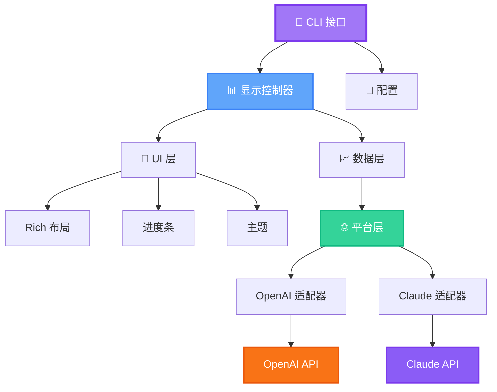

<div align="center">


# 🎯 GenAI 代码使用监控器

### *您的 AI APIs 终极实时终端仪表盘*

<p align="center">
  <strong>以优雅和精确监控 OpenAI Codex 和 Claude Code APIs</strong>
</p>

---

### Languages / 语言

[English](./README.md) | **中文**

---

<p>
  <a href="https://pypi.org/project/genai-code-usage-monitor/">
    
  </a>
  <a href="https://python.org">
    
  </a>
  <a href="https://opensource.org/licenses/MIT">
    
  </a>
</p>

<p>
  <a href="http://makeapullrequest.com">
    
  </a>
  <a href="https://github.com/yourusername/genai-code-usage-monitor">
    
  </a>
  <a href="https://www.w3.org/WAI/WCAG2AA-Conformance">
    
  </a>
</p>

<p>
  
  
  
</p>


*体验实时监控，配备精美的终端 UI、智能警报和基于机器学习的预测*

[🚀 快速开始](#-快速开始) • [✨ 特性](#-特性) • [📖 文档](#-文档) • [🤝 贡献](#-贡献)

</div>

---

## 🌟 为什么选择 GenAI 代码使用监控器？

<table>
<tr>
<td width="50%">

### 🎨 **精美且易访问**
- WCAG 2.1 AA 标准色彩方案
- 自动检测终端背景
- 带进度条的 Rich 终端 UI
- 三款精美主题：亮色、暗色、经典

</td>
<td width="50%">

### 🚀 **双平台支持**
- 监控 OpenAI Codex/GPT APIs
- 跟踪 Claude Code 使用情况
- 统一的平台界面
- 跨平台成本比较

</td>
</tr>
<tr>
<td width="50%">

### 💰 **成本优化**
- 跟踪缓存令牌（90% 折扣！）
- 实时消耗率分析
- 预算警报和建议
- 基于机器学习的使用预测

</td>
<td width="50%">

### ⚡ **智能且快速**
- P90 百分位分析
- 4 级警报系统（信息/警告/严重/危险）
- 可配置的刷新率
- 多线程架构

</td>
</tr>
</table>

---

## ✨ 特性

### 🔥 核心功能

```ascii
┌─────────────────────────────────────────────────────────────────┐
│  🎯 双平台支持           │  📊 高级分析                        │
│  🎨 WCAG 兼容主题        │  💾 缓存令牌跟踪                    │
│  ⚠️  4 级警报系统         │  🔮 基于 ML 的预测                 │
│  📈 多种视图模式         │  🚀 实时监控                        │
└─────────────────────────────────────────────────────────────────┘
```

<details>
<summary>🔍 点击查看所有功能详情</summary>

#### 🌐 **双平台支持**
- ✅ OpenAI Codex/GPT API 监控
- ✅ Claude Code API 监控
- ✅ 平台自动检测
- ✅ 并排比较模式
- ✅ 平台特定功能（Claude 的缓存跟踪）

#### 📊 **高级分析**
- ✅ 令牌使用跟踪（输入/输出/缓存）
- ✅ 模型特定定价的成本计算
- ✅ 消耗率分析
- ✅ P90 百分位计算
- ✅ 会话限制预测

#### 🎨 **专业 UI**
- ✅ 带彩色进度条的 Rich 终端布局
- ✅ 三款 WCAG 兼容主题（亮色/暗色/经典）
- ✅ 自动终端背景检测
- ✅ 适应终端大小的响应式设计
- ✅ Unicode 图表和可视化

#### ⚠️ **智能警报**
- ✅ 4 级警报：信息 → 警告 → 严重 → 危险
- ✅ 智能阈值检测
- ✅ 可操作的建议
- ✅ 到达限制时间估计

#### 💾 **缓存优化**（Claude）
- ✅ 带 90% 折扣的缓存令牌跟踪
- ✅ 缓存命中率监控
- ✅ 实时节省分析
- ✅ 缓存效率建议

#### 🔮 **ML 预测**
- ✅ 使用趋势预测
- ✅ 成本预测
- ✅ 置信度评分
- ✅ 智能限制检测

</details>

---

## 🚀 快速开始

### ⚡ 安装（选择一种）

<table>
<tr>
<td width="33%">

#### 🎯 **uv（推荐）**
```bash
# 安装 uv
curl -LsSf https://astral.sh/uv/install.sh | sh

# 安装工具
uv tool install genai-code-usage-monitor

# 运行
code-monitor
```
✅ 隔离环境
✅ 无冲突
✅ 易于更新

</td>
<td width="33%">

#### 📦 **pip**
```bash
# 安装
pip install genai-code-usage-monitor

# 添加到 PATH
export PATH="$HOME/.local/bin:$PATH"

# 运行
code-monitor
```
✅ 简单
✅ 熟悉
✅ 到处可用

</td>
<td width="33%">

#### 🍺 **Homebrew**
```bash
# 安装
brew install code-monitor

# 运行
code-monitor
```
✅ 原生 macOS
✅ 自动更新
✅ 干净卸载

</td>
</tr>
</table>

### 🎬 首次运行

```bash
# 设置您的 API 密钥
export OPENAI_API_KEY="sk-..."
# 或
export ANTHROPIC_API_KEY="sk-ant-..."

# 启动监控器
code-monitor

# 🎉 就这样！监控器正在运行
```

---

## 📸 截图和演示

<div align="center">

### 🌙 暗色主题


### ☀️ 亮色主题


### 🎨 经典主题


</div>

---

## 💡 使用示例

### 🎯 **单平台**

```bash
# 监控 OpenAI（默认）
code-monitor

# 监控 Claude
code-monitor --platform claude

# 从环境自动检测
code-monitor --platform auto
```

### 🔄 **双平台**

```bash
# 并排监控两个平台
code-monitor --platform both

# 导出比较报告
code-monitor --platform both --export comparison.json
```

### 🎨 **主题选择**

```bash
# 自动检测（推荐）
code-monitor --theme auto

# 特定主题
code-monitor --theme dark
code-monitor --theme light
code-monitor --theme classic
```

### ⚙️ **高级配置**

```bash
# 带令牌限制的自定义计划
code-monitor --plan custom --custom-limit-tokens 100000

# 活跃开发的快速刷新
code-monitor --refresh-rate 5

# 带日志的调试模式
code-monitor --debug --log-file monitor.log

# 不同时区
code-monitor --timezone America/New_York
```

---

## 📊 监控计划

<div align="center">

| 计划 | 令牌限制 | 成本限制 | 最适合 | 命令 |
|:----:|:-----------:|:----------:|:--------:|:--------|
| 🆓 **免费** | 100,000 | $0 | 免费层用户 | `--plan free` |
| 💳 **按需付费** | 无限制 | $100 | 灵活使用 | `--plan payg` |
| 🥉 **第 1 层** | 1,000,000 | $50 | 中度使用 | `--plan tier1` |
| 🥇 **第 2 层** | 5,000,000 | $250 | 重度使用 | `--plan tier2` |
| 🎯 **自定义** | 基于 P90 | $50 | 智能检测 | `--plan custom` ⭐ |

</div>

> 💡 **提示**：自定义计划（默认）使用 P90 分析自动从您的使用模式中学习！

---

## 🏗️ 架构

<div align="center">



</div>

### 📦 项目结构

```
genai-code-usage-monitor/
├── 🎯 cli/                    # 命令行界面
├── 🧠 core/                   # 业务逻辑
│   ├── models.py              # 数据模型
│   ├── plans.py               # 计划定义
│   ├── pricing.py             # 成本计算器
│   ├── alerts.py              # 警报系统
│   └── p90_calculator.py      # ML 分析
├── 🌐 platforms/              # 平台抽象
│   ├── base.py                # 平台接口
│   ├── codex.py               # OpenAI 适配器
│   └── claude.py              # Claude 适配器
├── 🎨 ui/                     # UI 组件
│   ├── display.py             # Rich 显示
│   ├── themes.py              # WCAG 主题
│   └── visualizations.py      # 图表和图形
└── 🛠️ utils/                  # 实用工具
    └── time_utils.py          # 时间函数
```

---

## 📚 文档

<div align="center">

### 📖 综合指南

| 类别 | 文档 | 描述 |
|:--------:|:---------|:------------|
| 🚀 | [QUICKSTART.md](QUICKSTART.md) | 新用户快速指南 |
| 📘 | [USAGE_GUIDE.md](USAGE_GUIDE.md) | 完整使用文档 |
| 🌐 | [PLATFORM_QUICK_REFERENCE.md](PLATFORM_QUICK_REFERENCE.md) | 双平台支持指南 |
| 🎨 | [THEME_SYSTEM.md](THEME_SYSTEM.md) | 完整主题文档 |
| 💾 | [docs/CACHE_AND_ALERTS.md](docs/CACHE_AND_ALERTS.md) | 缓存令牌和警报系统 |
| 📊 | [VISUALIZATION_GUIDE.md](VISUALIZATION_GUIDE.md) | 图表和可视组件 |
| 🏗️ | [PLATFORM_LAYER_SUMMARY.md](PLATFORM_LAYER_SUMMARY.md) | 平台架构 |
| 📜 | [CHANGELOG.md](CHANGELOG.md) | 版本历史和更新 |

</div>

---

## 🎓 示例学习

<details>
<summary>🌅 <strong>晨间开发者</strong> - 上午 9 点重置</summary>

```bash
# 设置与工作时间表对齐的自定义重置时间
code-monitor --reset-hour 9 --timezone America/New_York

# 开始编码时启动监控
code-monitor --plan custom --refresh-rate 5
```

</details>

<details>
<summary>🌙 <strong>夜猫子</strong> - 深夜编码会话</summary>

```bash
# 在午夜重置以获得干净的每日边界
code-monitor --reset-hour 0

# 或深夜重置
code-monitor --reset-hour 23 --timezone UTC
```

</details>

<details>
<summary>🔄 <strong>重度用户</strong> - 可变使用模式</summary>

```bash
# 从历史使用自动检测
code-monitor --plan custom

# 使用自定义调度监控
code-monitor --plan custom --reset-hour 6 --refresh-rate 3
```

</details>

<details>
<summary>🌍 <strong>国际团队</strong> - 多个时区</summary>

```bash
# 美国东海岸
code-monitor --timezone America/New_York

# 欧洲
code-monitor --timezone Europe/London

# 亚太地区
code-monitor --timezone Asia/Tokyo

# UTC 协调
code-monitor --timezone UTC --reset-hour 12
```

</details>

---

## 🔧 高级功能

### 🎯 警报系统

```bash
# 4 级渐进式警报
┌──────────────┬─────────────┬──────────────────────────────┐
│ 级别         │ 阈值        │ 操作                         │
├──────────────┼─────────────┼──────────────────────────────┤
│ 📘 信息      │ < 50%       │ 正常继续                     │
│ ⚠️  警告      │ 50-75%      │ 监控使用                     │
│ 🔶 严重      │ 75-90%      │ 减少消耗                     │
│ 🔴 危险      │ > 90%       │ 需要立即采取行动             │
└──────────────┴─────────────┴──────────────────────────────┘
```

### 💾 缓存优化（Claude）

```bash
# 使用 90% 折扣跟踪缓存令牌
code-monitor --platform claude

# 查看缓存统计信息
# • 缓存命中率：45%
# • 节省：$12.50（90% 折扣）
# • 缓存令牌：125,000
# • 缓存效率：高 ✅
```

### 🔮 ML 预测

```python
# 基于以下内容的智能预测：
• 历史使用模式（8 天）
• P90 百分位分析
• 消耗率趋势
• 会话模式

# 预测包括：
• 带置信度评分的成本预测
• 到达限制时间估计
• 使用趋势分析
• 智能限制建议
```

---

## 🛠️ 技术要求

### 📋 依赖项

所有依赖项都会自动安装：

```toml
openai>=1.0.0                 # OpenAI API 客户端
rich>=13.7.0                  # 终端 UI 框架
pydantic>=2.0.0               # 数据验证
pydantic-settings>=2.0.0      # 配置
numpy>=1.21.0                 # 统计分析
pytz>=2023.3                  # 时区支持
requests>=2.31.0              # HTTP 客户端
pyyaml>=6.0                   # 配置文件
```

### 🐍 Python 支持

<div align="center">

| 版本 | 状态 | 推荐 |
|:-------:|:------:|:-----------:|
| 3.9 | ✅ 支持 | |
| 3.10 | ✅ 支持 | |
| 3.11 | ✅ 支持 | ⭐ |
| 3.12 | ✅ 支持 | ⭐ |

</div>

### 💻 平台支持

<div align="center">

| 操作系统 | 状态 | 注释 |
|:--:|:------:|:------|
| 🐧 Linux | ✅ 完全支持 | 所有发行版 |
| 🍎 macOS | ✅ 完全支持 | Intel 和 Apple Silicon |
| 🪟 Windows | ✅ 完全支持 | 推荐 Windows 终端 |

</div>

---

## 🤝 贡献

我们欢迎贡献！🎉

<div align="center">

### 🌟 贡献方式

| 类型 | 描述 | 如何帮助 |
|:----:|:------------|:------------|
| 🐛 | 错误报告 | [打开问题](https://github.com/yourusername/genai-code-usage-monitor/issues) |
| 💡 | 功能请求 | [开始讨论](https://github.com/yourusername/genai-code-usage-monitor/discussions) |
| 📝 | 文档 | 改进指南和示例 |
| 🔧 | 代码 | 提交拉取请求 |
| 🌍 | 翻译 | 帮助翻译文档 |

</div>

### 🚀 快速贡献指南

```bash
# 1. Fork 并克隆
git clone https://github.com/yourusername/genai-code-usage-monitor.git
cd genai-code-usage-monitor

# 2. 创建虚拟环境
python -m venv venv
source venv/bin/activate  # Windows: venv\Scripts\activate

# 3. 安装开发依赖项
pip install -e ".[dev]"

# 4. 创建功能分支
git checkout -b feature/amazing-feature

# 5. 进行更改和测试
pytest tests/

# 6. 提交并推送
git commit -m "feat: Add amazing feature"
git push origin feature/amazing-feature

# 7. 打开拉取请求 🎉
```

详细指南请参阅 [CONTRIBUTING.md](CONTRIBUTING.md)。

---

## 📊 项目统计

<div align="center">


</div>

---

## 📄 许可证

<div align="center">

本项目根据 **MIT 许可证** 授权 - 详情请参阅 [LICENSE](LICENSE) 文件。

```
MIT 许可证 - 可自由使用、修改和分发
✅ 商业使用  ✅ 修改  ✅ 分发  ✅ 私人使用
```

</div>

---

## 💖 致谢

<div align="center">

### 🙏 特别感谢

本项目受到 [Claude Code Usage Monitor](https://github.com/Maciek-roboblog/Claude-Code-Usage-Monitor) 的启发

### 🛠️ 使用优秀工具构建


</div>

---

## 🌟 Star 历史

<div align="center">

[](https://star-history.com/#yourusername/genai-code-usage-monitor&Date)

</div>

---

## 🔗 链接

<div align="center">

### 📌 快速链接

[🏠 主页](https://github.com/yourusername/genai-code-usage-monitor) •
[📦 PyPI](https://pypi.org/project/genai-code-usage-monitor/) •
[📖 文档](https://github.com/yourusername/genai-code-usage-monitor#readme) •
[🐛 问题](https://github.com/yourusername/genai-code-usage-monitor/issues) •
[💬 讨论](https://github.com/yourusername/genai-code-usage-monitor/discussions) •
[📜 更新日志](CHANGELOG.md)

</div>

---

<div align="center">

## ⭐ 给我们点赞！

**如果您觉得这个项目有用，请考虑给它一个星标！**

<a href="https://github.com/yourusername/genai-code-usage-monitor/stargazers">
  
</a>

### 🚀 监控愉快！

由 GenAI Monitor Team 用 ❤️ 制作

---

<sub>🌐 中文 | <a href="./README.md">English</a></sub>

</div>
